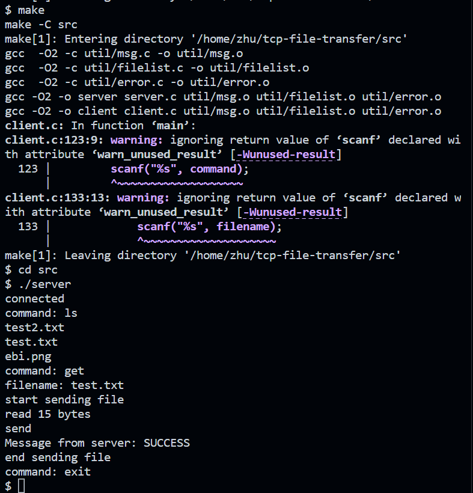
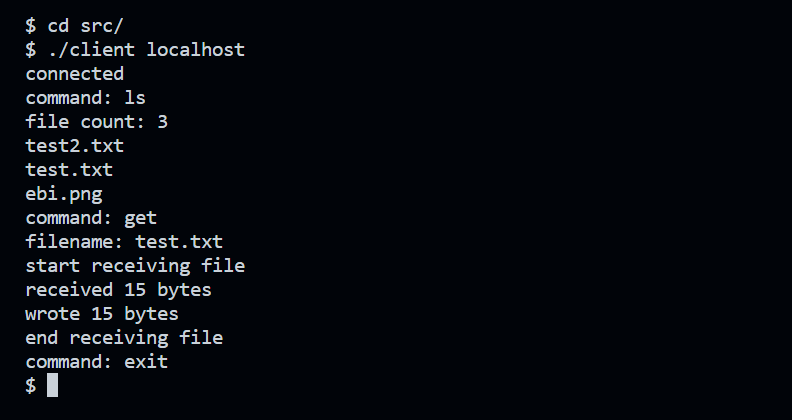

# TCP File Server and Client


オペレーティングシステムBの課題

ソケットAPI（システムコール）を用いたプログラム

C言語で、TCP通信を用いたファイルサーバーとクライアントを実装しました。

## Build
サーバーディレクトリはデフォルトで`dir`となっています。
変更するには、`src/server.c`の`SERVER_DIR`を変更してください。

```bash
make
```

実行ファイルを削除する場合はcleanを実行
```bash
make clean
```

## Run
```bash
cd src
./server
```
serverを起動した後に別のターミナルで
```bash
cd src
./client localhost
```
を実行すると、clientがserverに接続し、コマンドを送信できる

**Note1:** clientはserverが起動していないと接続できない

**Note2:** localhostはserverのホスト名かIPアドレス

**Note3:** current directoryはsrcである必要がある

## コマンド一覧
|コマンド|説明|
|:--|:--|
|ls|サーバーディレクトリのファイル一覧を取得|
|get|ファイルをダウンロード|
|exit|サーバーとの接続を切断|

## 実行例
1. lsコマンドを実行
2. getコマンドを実行
    - test.txtをダウンロード
3. exitコマンドを実行




## References
https://daeudaeu.com/c-http-server/
https://9cguide.appspot.com/17-02.html
https://www.ibm.com/docs/ja/zos/2.3.0?topic=functions-recv
https://zenn.dev/blackengineer/articles/105a94783a205612f548
